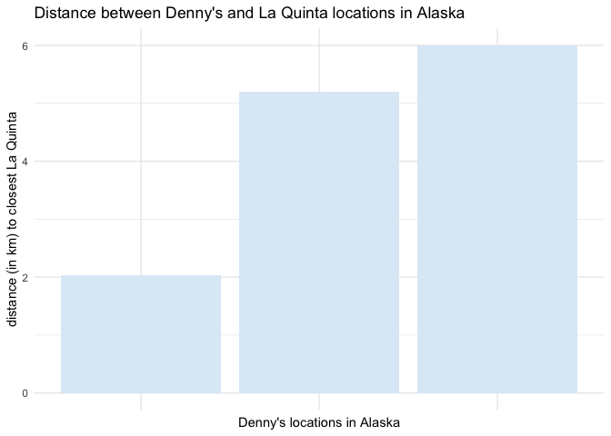
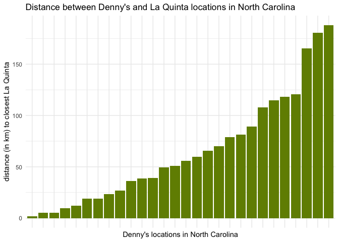
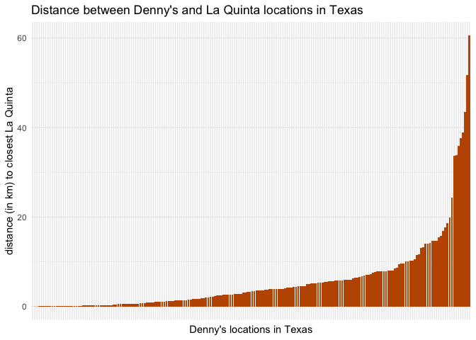
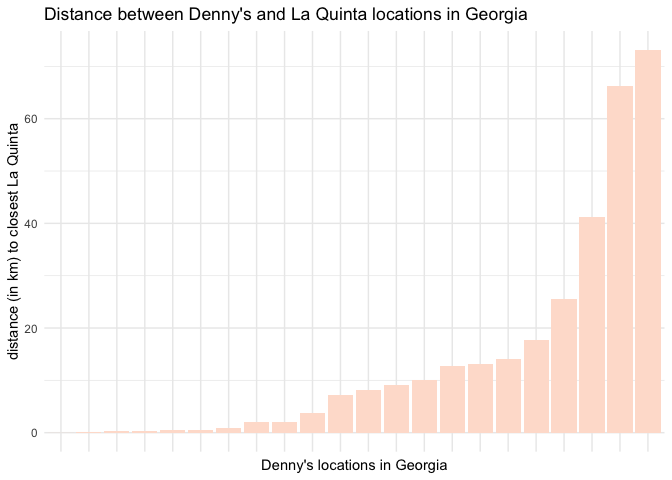

Lab 05 - La Quinta is Spanish for next to Denny’s, Pt. 2
================
Rowan Kemmerly
3.4.23

### Load packages and data

``` r
# install.packages("devtools")
devtools::install_github("rstudio-education/dsbox")


library(tidyverse) 
library(dsbox) 
```

``` r
states <- read_csv("data/states.csv")

dn <- dennys
lq <- laquinta
```

### Exercise 1

``` r
dn_ak <- dn %>%
  filter(state == "AK")

nrow(dn_ak)
```

    ## [1] 3

There are three Denny’s locations in Alaska.

### Exercise 2

``` r
lq_ak <- lq %>%
  filter(state == "AK")
nrow(lq_ak)
```

    ## [1] 2

There are two La Quinta locations in Alaska.

### Exercise 3

There are six possible pairings of Denny’s locations and La Quinta
locations in Alaska (3 Denny’s x 2 La Quintas = 6 pairings).

I’m now going to join the Denny’s and La Quinta data frames (for Alaska)
to create these pairings:

``` r
dn_lq_ak <- full_join(dn_ak, lq_ak, by = "state")
dn_lq_ak
```

    ## # A tibble: 6 × 11
    ##   address.x      city.x state zip.x longi…¹ latit…² addre…³ city.y zip.y longi…⁴
    ##   <chr>          <chr>  <chr> <chr>   <dbl>   <dbl> <chr>   <chr>  <chr>   <dbl>
    ## 1 2900 Denali    Ancho… AK    99503   -150.    61.2 3501 M… "\nAn… 99503   -150.
    ## 2 2900 Denali    Ancho… AK    99503   -150.    61.2 4920 D… "\nFa… 99709   -148.
    ## 3 3850 Debarr R… Ancho… AK    99508   -150.    61.2 3501 M… "\nAn… 99503   -150.
    ## 4 3850 Debarr R… Ancho… AK    99508   -150.    61.2 4920 D… "\nFa… 99709   -148.
    ## 5 1929 Airport … Fairb… AK    99701   -148.    64.8 3501 M… "\nAn… 99503   -150.
    ## 6 1929 Airport … Fairb… AK    99701   -148.    64.8 4920 D… "\nFa… 99709   -148.
    ## # … with 1 more variable: latitude.y <dbl>, and abbreviated variable names
    ## #   ¹​longitude.x, ²​latitude.x, ³​address.y, ⁴​longitude.y

### Exercise 4

There are six observations (6 rows) and 11 variables (11 columns):
address.x, city.x, state, zip.x, longitude.x, latitude.x, address.y,
city.y, zip.y, longitude.y, and latitude.y.

### Exercise 5

We can use the “mutate” function to add a new variable to a data frame
while keeping the existing variables.

Re-creating the Haversine function for our purposes here:

``` r
haversine <- function(long1, lat1, long2, lat2, round = 3) {
  # convert to radians
  long1 = long1 * pi / 180
  lat1  = lat1  * pi / 180
  long2 = long2 * pi / 180
  lat2  = lat2  * pi / 180
  
  R = 6371 # Earth mean radius in km
  
  a = sin((lat2 - lat1)/2)^2 + cos(lat1) * cos(lat2) * sin((long2 - long1)/2)^2
  d = R * 2 * asin(sqrt(a))
  
  return( round(d,round) ) # distance in km
}
```

### Exercise 6

Calculating the distances between all pairs of Denny’s and La Quinta
locations in Alaska:

``` r
dn_lq_ak <- dn_lq_ak %>%
  mutate(distance = haversine(longitude.x, latitude.x, longitude.y, latitude.y, round = 3))

dn_lq_ak
```

    ## # A tibble: 6 × 12
    ##   address.x      city.x state zip.x longi…¹ latit…² addre…³ city.y zip.y longi…⁴
    ##   <chr>          <chr>  <chr> <chr>   <dbl>   <dbl> <chr>   <chr>  <chr>   <dbl>
    ## 1 2900 Denali    Ancho… AK    99503   -150.    61.2 3501 M… "\nAn… 99503   -150.
    ## 2 2900 Denali    Ancho… AK    99503   -150.    61.2 4920 D… "\nFa… 99709   -148.
    ## 3 3850 Debarr R… Ancho… AK    99508   -150.    61.2 3501 M… "\nAn… 99503   -150.
    ## 4 3850 Debarr R… Ancho… AK    99508   -150.    61.2 4920 D… "\nFa… 99709   -148.
    ## 5 1929 Airport … Fairb… AK    99701   -148.    64.8 3501 M… "\nAn… 99503   -150.
    ## 6 1929 Airport … Fairb… AK    99701   -148.    64.8 4920 D… "\nFa… 99709   -148.
    ## # … with 2 more variables: latitude.y <dbl>, distance <dbl>, and abbreviated
    ## #   variable names ¹​longitude.x, ²​latitude.x, ³​address.y, ⁴​longitude.y

### Exercises 7 and 8

Calculating the minimum distance between a Denny’s and La Quinta for
each Denny’s location in Alaska and looking at summary statistics:

``` r
dn_lq_ak_mindist <- dn_lq_ak %>%
  group_by(address.x) %>%
  summarize(closest = min(distance)) %>%
  arrange(closest) %>%
  mutate(address.x = fct_inorder(address.x))

dn_lq_ak_mindist
```

    ## # A tibble: 3 × 2
    ##   address.x        closest
    ##   <fct>              <dbl>
    ## 1 2900 Denali         2.04
    ## 2 1929 Airport Way    5.20
    ## 3 3850 Debarr Road    6.00

``` r
summary(dn_lq_ak_mindist)
```

    ##             address.x    closest     
    ##  2900 Denali     :1   Min.   :2.035  
    ##  1929 Airport Way:1   1st Qu.:3.616  
    ##  3850 Debarr Road:1   Median :5.197  
    ##                       Mean   :4.410  
    ##                       3rd Qu.:5.598  
    ##                       Max.   :5.998

In Alaska, 2/3 Denny’s locations are about 5 km away from a La Quinta,
and 1 Denny’s is only about 2 km from a La Quinta.

``` r
ak_dennys <- ggplot(dn_lq_ak_mindist, aes(x= address.x, y = closest)) +
  geom_col(fill = '#deebf7') +
  labs(x = "Denny's locations in Alaska", y = "distance (in km) to closest La Quinta", title = "Distance between Denny's and La Quinta locations in Alaska") + 
  theme_minimal() +
    theme(axis.text.x=element_blank())

ak_dennys
```

<!-- -->

### Exercise 9

Repeating the same analysis for North Carolina:

``` r
dn_nc <- dn %>%
  filter(state == "NC")

lq_nc <- lq %>%
  filter(state == "NC")

dn_lq_nc <- full_join(dn_nc, lq_nc, by = "state")

dn_lq_nc <- dn_lq_nc %>%
  mutate(distance = haversine(longitude.x, latitude.x, longitude.y, latitude.y, round = 3))

dn_lq_nc_mindist <- dn_lq_nc %>%
  group_by(address.x) %>%
  summarize(closest = min(distance)) %>%
  arrange(closest) %>%
  mutate(address.x = fct_inorder(address.x))

summary(dn_lq_nc_mindist)
```

    ##                            address.x     closest       
    ##  516 Tyvola Rd                  : 1   Min.   :  1.779  
    ##  3215 Wake Forest Rd            : 1   1st Qu.: 22.388  
    ##  7021 Highway 751, #901         : 1   Median : 53.456  
    ##  4541 Sunset Rd                 : 1   Mean   : 65.444  
    ##  4380 Fayetteville Rd           : 1   3rd Qu.: 93.985  
    ##  University of North Carolina At: 1   Max.   :187.935  
    ##  (Other)                        :22

``` r
nc_dennys <- ggplot(dn_lq_nc_mindist, aes(x= address.x, y = closest)) +
  geom_col(fill = '#718C00') +
  labs(x = "Denny's locations in North Carolina", y = "distance (in km) to closest La Quinta", title = "Distance between Denny's and La Quinta locations in North Carolina") +
  theme_minimal() +
    theme(axis.text.x=element_blank())

nc_dennys
```

<!-- -->

### Exercise 10

Repeating the same analysis for Texas:

``` r
dn_tx <- dn %>%
  filter(state == "TX")

lq_tx <- lq %>%
  filter(state == "TX")

dn_lq_tx <- full_join(dn_tx, lq_tx, by = "state")

dn_lq_tx <- dn_lq_tx %>%
  mutate(distatxe = haversine(longitude.x, latitude.x, longitude.y, latitude.y, round = 3))

dn_lq_tx_mindist <- dn_lq_tx %>%
  group_by(address.x) %>%
  summarize(closest = min(distatxe)) %>%
  arrange(closest) %>%
  mutate(address.x = fct_inorder(address.x))

summary(dn_lq_tx_mindist)
```

    ##                       address.x      closest       
    ##  607 Avenue Q              :  1   Min.   : 0.0160  
    ##  1410 Seawall Blvd         :  1   1st Qu.: 0.7305  
    ##  3600 Santa Ursula         :  1   Median : 3.3715  
    ##  7619 E Ben White Boulevard:  1   Mean   : 5.7918  
    ##  28669 I-45 North          :  1   3rd Qu.: 6.6303  
    ##  1108 S Fort Hood Rd       :  1   Max.   :60.5820  
    ##  (Other)                   :194

``` r
tx_dennys <- ggplot(dn_lq_tx_mindist, aes(x= address.x, y = closest)) +
  geom_col(fill = '#BF5700') +
  labs(x = "Denny's locations in Texas", y = "distance (in km) to closest La Quinta", title = "Distance between Denny's and La Quinta locations in Texas") +
  theme_minimal() +
  theme(axis.text.x=element_blank())

tx_dennys
```

<!-- -->

### Exercise 11

Repeating the same analysis for Georgia (where I was born):

``` r
dn_ga <- dn %>%
  filter(state == "GA")

lq_ga <- lq %>%
  filter(state == "GA")

dn_lq_ga <- full_join(dn_ga, lq_ga, by = "state")

dn_lq_ga <- dn_lq_ga %>%
  mutate(distagae = haversine(longitude.x, latitude.x, longitude.y, latitude.y, round = 3))

dn_lq_ga_mindist <- dn_lq_ga %>%
  group_by(address.x) %>%
  summarize(closest = min(distagae)) %>%
  arrange(closest) %>%
  mutate(address.x = fct_inorder(address.x))

summary(dn_lq_ga_mindist)
```

    ##                 address.x     closest       
    ##  3026 Washington Rd  : 1   Min.   : 0.0240  
    ##  6801 Abercorn St    : 1   1st Qu.: 0.6777  
    ##  1020 Tanger Rd      : 1   Median : 7.7065  
    ##  3239 MacOn Rd       : 1   Mean   :14.0458  
    ##  1328 St Augustine Rd: 1   3rd Qu.:13.8810  
    ##  1 Gateway Blvd      : 1   Max.   :73.1200  
    ##  (Other)             :16

``` r
ga_dennys <- ggplot(dn_lq_ga_mindist, aes(x= address.x, y = closest)) +
  geom_col(fill = '#FEE0D2') +
  labs(x = "Denny's locations in Georgia", y = "distance (in km) to closest La Quinta", title = "Distance between Denny's and La Quinta locations in Georgia") +
  theme_minimal() +
  theme(axis.text.x=element_blank())

ga_dennys
```

<!-- -->

### Exercise 12

Of the states I examined, I think the joke holds true most in Texas!
(Because it’s such a negatively skewed distribution.) Though the
distribution in Georgia does look quite similar (there just aren’t
nearly as many Denny’s locations all in all).
